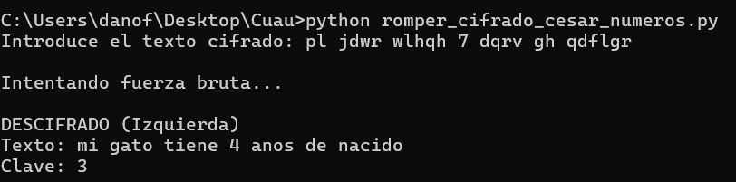
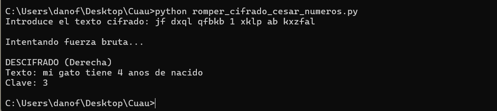

# Romper Cifrado César con Alfabeto Ampliado
Tambien tenemos las versiones anteriores de los codigos los cuales usamos para poder realizar la ruptura del cifrado pero con numeros

Programa en Python que rompe el cifrado César utilizando:
- Alfabeto ampliado (a-z, 0-9)
- Recorrimiento a izquierda y derecha
- Fuerza bruta
- Detección automática de idioma (español)

## Capturas de ejecución

### Ejemplo 1

### Ejemplo 2

